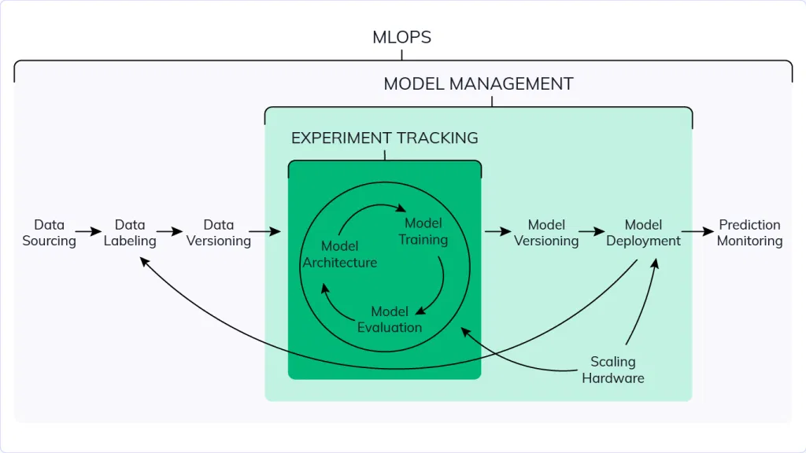

# Model Management

## Machine Learning Lifecycle

Note that model management includes experiment tracking, but with versioning, deployment, and hardware scaling.

Once finished with experiment tracking, we think about saving this model, aka versioning.
- Then we move on to deployment. We find it may need to be updated to be able to scale 
- Then we move on to **Prediction Monitoring**

## Model Management
Can use folders to manage models
- Error prone - could end up overwriting models easily
- No versioning - hard to find old models
- No model lineage - hard to check parameters or motivations

Can easily save model with mlflow.log_artifact()
	- Can have local path
	- Can have artifact path to see in mlflow

Second way to log models to easily use it after
	- mlflow.xgboost.log_model() - takes model file and artifact path
	- Most important file is MLmodel - created by mlflow for model metadata
		- Model flavors:
			- Python function: Model can be loaded as python method
			- xgbost: Model can be loaded xgboost
	- conda.yaml file
		- Shows python and pip versions
		- Shows pip requirements and versions 
			- Had to assume some versions like scikit-learn
	- requirements.txt file
		- No python version

Going to do again with autolog but add step to log preprocessor. Generates preprocessor artifact
	- mlflow.log_artifact("models/preprocessor.b", artifact_path="preprocessor")
	- Also saves this with pickle (otherwise only logs to mlflow)

## Predictions
- Go to mlflow artifacts > models_mlflow
	- Can see how to make predictions with various DataFrame types
	- Shows you how to open logged_model (used with model uri)
		- Then use mlflow load model and use it to make predictions
- Predictions demo:
	- Gets logged_model via Pandas method
	- Can load with Python flavor right from code given
		- Can load via xgboost_model with mlflow.xgboost.load_model(logged_model)
		- Can see methods of this model in xgboost flavor now
	- Model predictions should be the same as the ones when we trained
