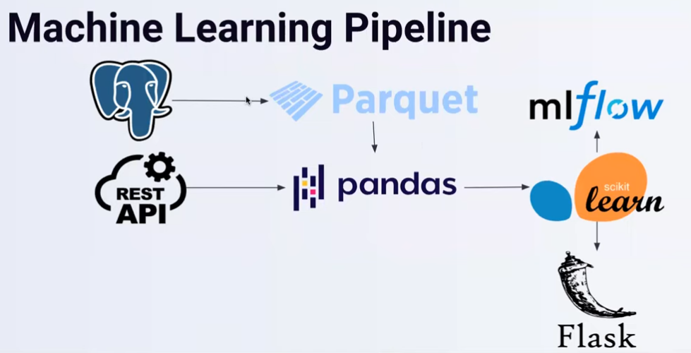
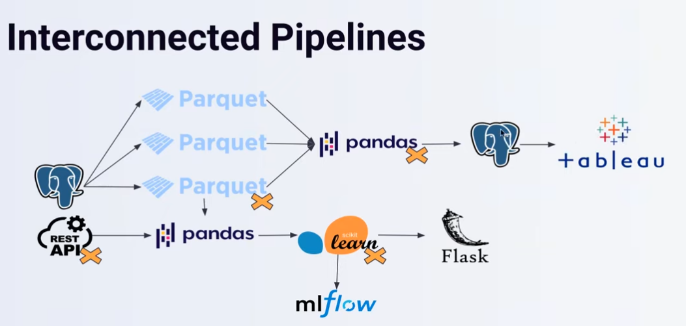

# Intro to Workflow Orchestartion with Prefect
Recall: Discussion on getting candidate model from staging to production
	- We will see how to automate this or get this on a schedule 

Workflow Orchestration is basically, a set of tools that schedule and monitor some work.
	- Ex: ML pipeline on a weekly schedule. If it fails, you need observability

Example: PSQL database that outputs some joins into a Parquet file.
	- Pandas ingests this along with API data and passes to scikit-learn to train a model
	- SKlearn registers the experiment/run and model to mlflow
	- If model meets some condition, deploy with Flask
### Points of Failure
	- PSQL gives malformed data
	- API or MLflow don't connect
	- MLflow database is disconnected or overloaded
Point of Workflow Orchestration is to prevent failures or fail gracefully

## Interconneced Pipelines
- More places things can fail - much more activity going on

- Maybe bottom (ML) pipeline and above (BI) pipeline interconnect
	- PSQL writes to Parquets to Pandas and does some processing then to another PSQL table so Tableau can visualize
	- If we put this on a schedule there are a lot more points of failure
	- Maybe if Parquet fails we have some failure mechanism for pandas regardless
	- Workflow orchestration also dictates when we want downstream tests to run

## Negative Engineering
90% of engineering time spent
- Retries when APIs go down
- Malformed data
- Notifications
- Observability into Failure
- Conditional Failure Logic
- Timeouts

More and more you are coding against failure rather than coding for new work - Prefect calls this Negative Engineering
Old proverb - 90% of data science is negative engineering and 10% is actually modelling.
	- People are hired for a specific use case - usually modelling
	- However, if something like Prefect can reduce 90% to even 80% or 70% you double productivity

Get retries off the shelf, have easy programmed failure paths, etc.
