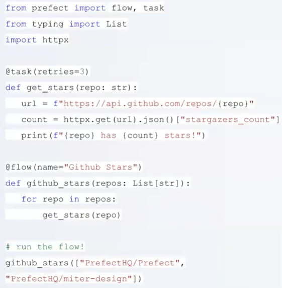

# Introduction to Prefect
Eliminating Negative Engineering
- Open-source workflow orchestration
- Python-based
- Modern data stack
	- Python data integration
- Native Dask integration
- Very active community
- Prefect Cloud/Prefect Server
	- Cloud can make some things easier
- Prefect Orion (Name of Prefect 2.0, 1.0 called Core)
	- Had Prefect 1.0 for 3 years and needed architecture overhaul for modern data (because of the DAG)
		- Old orchestration required pipelines must be a DAG (Directed Acyclic Graph)
		- During execution with triggers etc, can choose what paths to run
	- Because of DAG requirement, developers were often fighting the DAG, so Orion wants to change this
	- ONLY 1.0 available today, but 2.0 will be available in the future

## Current state of Prefect
- Embracing dynamic, DAG-free workflows
- An extraordinary developer experience
- Transparent and observable orchestration rules

- Normal Python functions to get Github Stars
- Annotation @task gives retries for free, API calls can automatically retry
	- @flow gives observability for pipeline

## Jupyter to Python
Now, want to bring Jupyter notebook from Week 2 to script so we can deploy.
1. Hard to work with
2. Can't really be deployed
3. Can't unit test

Ochestration.py is what we want to make
Requirements.txt: note Prefect 2.0 is beta and pin your version

Get duration-prediction.py from Week 2
- Main ways to do this, point is that you end up modularized
- Awkward task to unwrap Python code
	- Lots of global variables, which is bad for good code
- Remove autolog section
	- Primarily interested in
		1. Model training
		2. Hyperparameter gridsearch
- Function add_features() - turning vectorization into function. Move in DictVectorizer()
	- Will need parameterizable in future, so Prefect can just change the call
	- End with and return the 4 variables and DictVectorizer (X/y, val/train)
- Parquet around 1/4 size of CSV
	- Holds schema, scalable to big data easily
- Try commenting everything below add_features() and try running with add_features()
	- Try printing X_train
- Function train_model_search() - Adding the gridsearch section all into one function
	- Keep the objective function within this one
	- End with and return best_result
- Function train_best_model() - basically same as above but with
- End with function calls
	- Start with if __name__ == "__main__": (code only runs when file called on its on - not imported)
	- Put in all function calls and xgb Dmatrices

